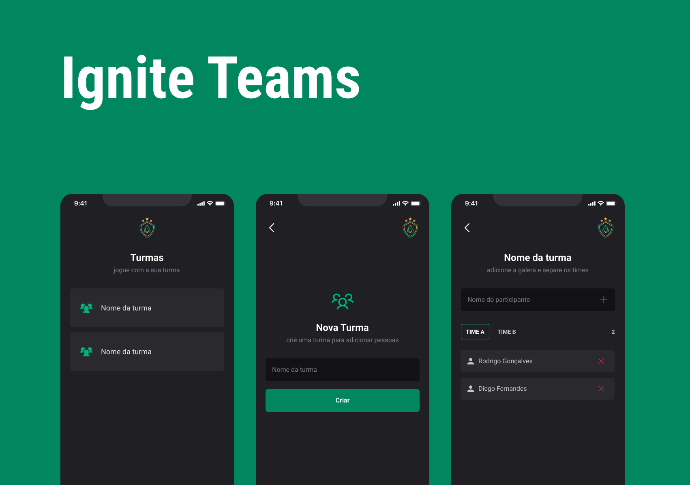

<h1 align="center">
   Ignite Teams
</h1> 

<div align="center">
  <b>
    <a href="#-Technologies"><b>Technologies</b></a>&nbsp;&nbsp;&nbsp;|&nbsp;&nbsp;&nbsp;
    <a href="#-Project"><b>Project</b></a>&nbsp;&nbsp;&nbsp;|&nbsp;&nbsp;&nbsp;
    <a href="#-Layout"><b>Layout</b></a>&nbsp;&nbsp;&nbsp;
  </b>  
</div>

---

<div align="center">
  
  
</div> 

</br>

## 🚀 Getting started

Clone o projeto e acesse a pasta.

```bash
# Clone the project
$ git clone https://github.com/diaspd/ignite-teams.git

# Install the dependencies
$ npm install

# Start the application
$ npm run start

```
</br>

## 💻 Technologies

O projeto foi desenvolvido com as seguintes tenologias:
<b>
- React Native
- Type Script
- Expo
- React Navigation
- Async Storage
</b>

</br>

## 📄 Project
💰 Projeto feito com React Native com base de design system, navegação e armazenamento local nele.

<br></br>

## 🔖 Layout
- [Ignite Teams - Figma](https://www.figma.com/community/file/1151864427495057381)

<br></br>

Made with ♥ by Kened Felix. </br>
